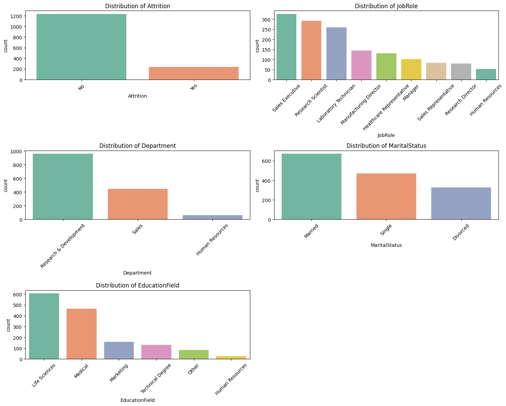
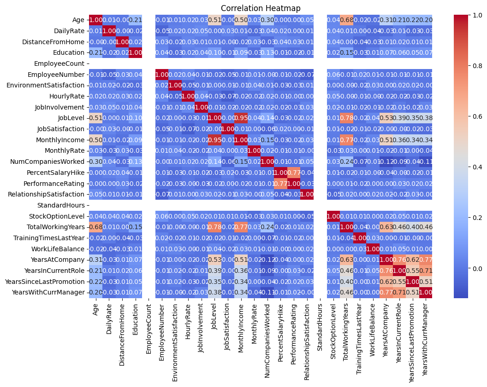
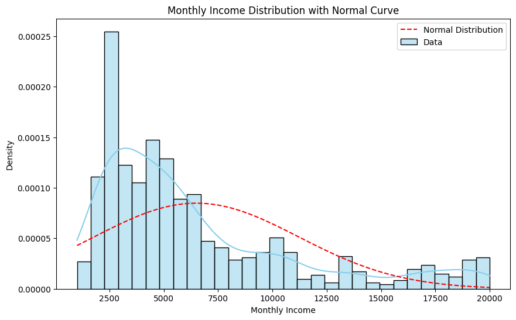
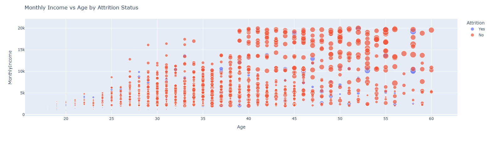
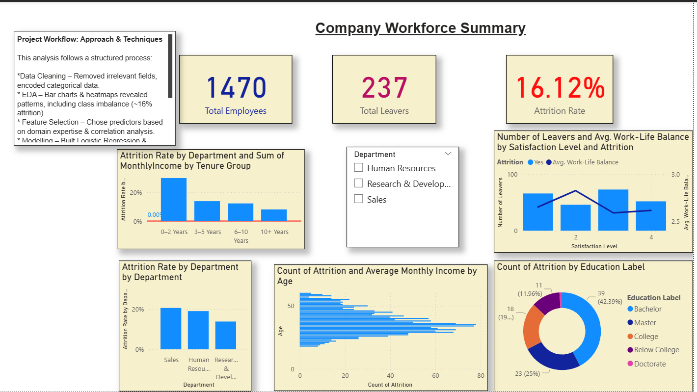
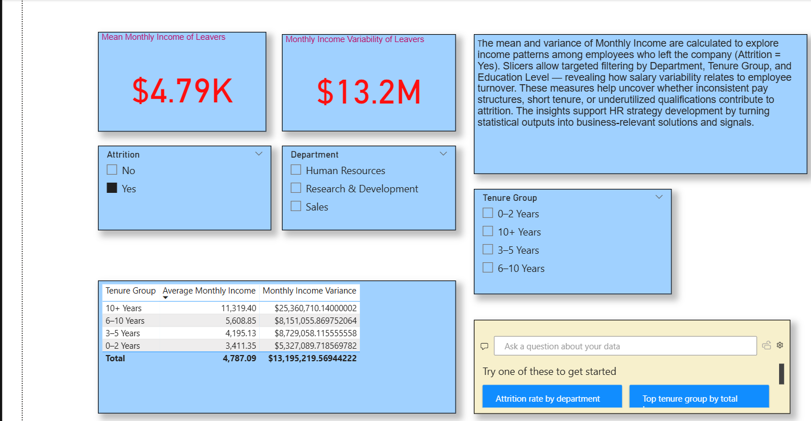

# 

##  Project Overview – IBM HR Attrition Analysis

This capstone project explores employee attrition using a real-world HR dataset provided by IBM. The goal is to identify key factors that influence employee turnover and develop predictive models that help HR teams make informed, data-driven decisions.

Using Python (Pandas, Seaborn, Matplotlib, Scikit-learn, Plotly) and Power BI, the project combines data analysis, visual storytelling, and machine learning to uncover insights around employee behaviour, job satisfaction, and organisational trends.

---

###  Project Objectives

- Investigate which personal and professional attributes (e.g., age, income, education, tenure) are linked to higher attrition risk
- Explore whether performance ratings correlate with attrition, satisfaction, or promotion likelihood
- Identify early warning signs of voluntary attrition
- Examine how departmental trends influence turnover, especially within high-performing teams
- Build classification models to predict which employees are at risk of leaving

---

###  Dataset

- Source: [IBM HR Analytics Attrition Dataset on Kaggle](https://www.kaggle.com/datasets/pavansubhasht/ibm-hr-analytics-attrition-dataset)
- Contains demographic, job-related, and performance data for 1,470 employees

---

###  Project Structure

1. **Data Cleaning & Preprocessing**  
   - Removed constant columns
   - Encoded categorical variables (e.g., Attrition → binary)
   - Saved processed dataset for modelling

2. **Exploratory Data Analysis (EDA)**  
   - Bar charts, histograms, and heatmaps to explore trends in attrition by department, role, income, and satisfaction

   ###  Categorical Feature Distributions
   

   ###  Correlation Heatmap
   

   ###  Monthly Income Distribution with Normal Curve
   

   ###  Monthly Income vs Age by Attrition Status
   

3. **Modelling**  
   - Logistic Regression  
   - Decision Tree Classifier  
   - Evaluation using accuracy, classification report, and confusion matrix  
   - Reflections on performance and class imbalance

4. **Dashboard Visualisation (Power BI)**  
   - Page 1: Workforce Overview — attrition by age, tenure, department  
   - Page 2: Statistical Insights — mean & variance, dynamic slicers to drill down by education, department, and satisfaction

---

###  Key Takeaways

- Class imbalance (only ~16% attrition) heavily influences model performance  
- Job level, total working years, and monthly income are strongly correlated  
- Satisfaction levels and short tenure appear to be early warning signs  
- Dashboards and visual storytelling can turn technical metrics into business-relevant insight

---

This project demonstrates a complete data analysis pipeline — from cleaning and visualisation to predictive modelling and stakeholder-ready dashboards.

## Project Plan & Dashboard Communication Strategy

###  Project Plan

This capstone project followed a structured data analysis pipeline, documented in the Jupyter Notebook and supported by the Power BI dashboard:

1. **Data Loading & Inspection**  
   - Reviewed the IBM HR Attrition dataset from Kaggle to understand structure, size, and feature types.

2. **Data Cleaning & Preprocessing**  
   - Removed irrelevant features, handled missing values, and encoded the target variable (`Attrition`) for modelling.

3. **Exploratory Data Analysis (EDA)**  
   - Used Python libraries (Seaborn, Matplotlib, Plotly) to uncover patterns in attrition by department, satisfaction, income, and experience.

4. **Modelling**  
   - Trained Logistic Regression and Decision Tree models to predict attrition.
   - Evaluated using accuracy, confusion matrix, and classification report.

5. **Reflection & Insights**  
   - Addressed class imbalance challenges.
   - Explained rationale behind methods and improvements made (e.g. model tuning, feature selection).

6. **Power BI Dashboard Creation**  
   - Built to communicate key findings interactively to both technical and business audiences.

---

###  Power BI Dashboard Design

The dashboard was structured across two pages to balance **strategic business insights** with **technical depth**:
##  Power BI Dashboard

###  Page 1: Company Workforce Summary

Visualisations include:
- Attrition by education level
- Monthly income vs age with attrition
- Attrition rate by department and tenure
- Number of leavers by satisfaction level

---

###  Page 2: Statistical Insights

Visualisations include:
- Mean and variance of Monthly Income for leavers
- Interactive slicers by Department, Tenure Group, and Education Level
- Insights into pay structure and attrition relationships

####  Page 1: Workforce Summary
This page targets **non-technical stakeholders (e.g., HR Managers)** by visually summarising workforce dynamics:

- **Attrition by Education Label**  
  Shows educational backgrounds of employees leaving the company.

- **Attrition & Average Monthly Income by Age**  
  Highlights income-age patterns and retention across generations.

- **Attrition Rate by Department**  
  Identifies departments with the highest turnover rates.

- **Attrition & Income by Tenure Group**  
  Reveals how long-serving employees compare to newer hires in terms of pay and attrition.

- **Work-Life Balance vs. Attrition**  
  Compares satisfaction levels to turnover, indicating which groups are at risk.

 *Purpose:* To support data-driven HR policies by clearly communicating trends and risks.

---

####  Page 2: Statistical Insights
This page supports **technical audiences and analysts** seeking deeper understanding through statistical metrics:

- **Mean & Variance of Monthly Income (Attrition = Yes)**  
  Analyses income variability among those who left.

- **Slicers (Department, Tenure Group, Education Level)**  
  Enable focused exploration of how attrition correlates with demographic and career factors.

  *Purpose:* To uncover nuanced drivers of attrition and support advanced segmentation strategies.

---

###  Communication Approach

- **For Technical Audiences:**  
  Jupyter Notebook includes detailed code, statistical outputs, modelling logic, and reflections on limitations.

- **For Non-Technical Stakeholders:**  
  Power BI visualisations simplify key insights (e.g., who is leaving and why) through clear charts, filters, and KPIs.

This dual approach ensures that findings are **accessible, actionable, and relevant** to a wide range of decision-makers.

##  8.2 – Employ Visualisations and Narratives to Enhance User Understanding

This project integrates a range of visualisation tools and narrative techniques to support both technical analysis and stakeholder communication.

###  In the Jupyter Notebook:
Visual tools such as **Matplotlib**, **Seaborn**, and **Plotly** were used to:

- Explore feature distributions (e.g., Attrition by Department, Education Field)
- Reveal correlations between numeric features using a **heatmap**
- Create **interactive dashboards** with Plotly to drill into department-level attrition and satisfaction trends

Each visualisation is accompanied by **clear markdown commentary** explaining:
- What the chart shows
- Why the chart is relevant
- Key insights and limitations

###  In the Power BI Dashboard:
Two dashboard pages were created to support **different audience needs**:

1. **Company Workforce Summary**
   - Shows high-level trends in attrition by education, department, age, tenure, and satisfaction

2. **Statistical Insights**
   - Communicates technical metrics like **mean** and **variance** using slicers and dynamic filtering

Design choices (e.g., bar charts, line graphs, tooltip details) were made to enhance **clarity and interpretability** for both technical and non-technical users.

---

These elements collectively ensure that the analysis is not only robust but also **accessible and actionable**, meeting the 8.2 requirement.

